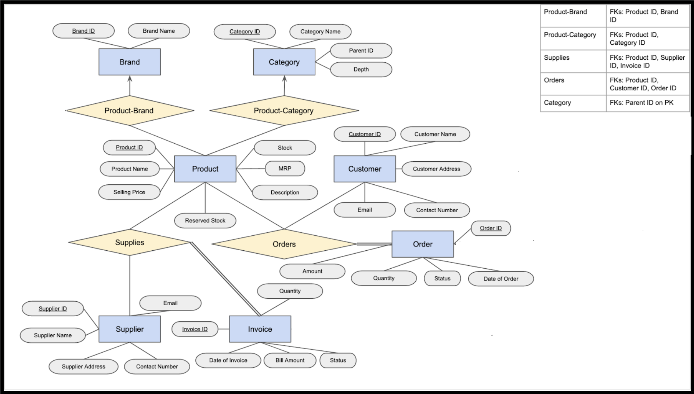

# <p align="center">Inventory Management System</p> 

### <p align="center">IT202 - Database Management Systems Course Project</p>

### Contributors

* Lakshya		(2K21/IT/101)
* Harsh Sharma 		(2K21/IT/73)

## Introduction:

Inventory management, in our context, involves the tracking of inventory (a list of items or goods) from manufacturers to a storeroom. It also involves the tracking of inventory from this storeroom to various customers.

To be more precise, we track invoices that are made by the storeroom to suppliers (manufacturers). We also keep tabs on orders that are made by customers to our storeroom. Payment information pertaining to these invoices and orders are also stored. Additionally, we maintain a well organized collection of products, along with the quantities that we currently have in stock. We also store relevant information about our customers and suppliers.

<p align ="center">

</p>

## ER Model:

The structure of our database (in the form of an entity - relationship model) consists of:


* **7** entities 
* **4** relationships.

**The entities (7):**


* **Brand** - Each member of this entity class represents a brand / company name. Multiple products can ‘belong’ to a single brand.
* **Category** - Each member of this entity class represents a specific product category. Multiple products in our inventory can fall into the same category. Categories can also have subcategories (a hierarchical structure can be made here).
* **Product** - Represents the items we can stock up in our inventory. Attributes include the product name, description, maximum retail price, as well the quantity that we currently have in stock (+ reserved stock).
* **Customer** - Each member corresponds to information about a customer. The attributes of this entity include the customer’s name, address & contact number + email address.
* **Supplier** - Represents the organizations / companies that supply us with various products. Attributes include the supplier name, address, contact number & email address.
* **Invoice** - Each member contains information about a particular order that we’ve made to a supplier. Some attributes: Invoice date, bill amount, quantity and status (whether the order has been fulfilled or not).
* **Order** - Each member corresponds to information about a particular order that a customer has made to us. Attributes: Order date, amount, quantity and status (whether the order has been fulfilled or not).

**The relationships (4):**


* **Product-Brand** - Connects products to their respective brands (if they belong to one). We thought of including total participation from products here, but that may create trouble when documenting products that do not actually belong to a brand (or are unbranded). The relation is many-to-one, in the sense that multiple products can belong to the same brand.
* **Product-Category** - Connects products to their respective product categories (if they belong to one). The relation is many-to-one, in the sense that multiple products can fall into the same category.
* **Supplies** - This relation joins members of the Supplier, Product and Invoice entity classes, and is used to represent the overall transfer of inventory from suppliers to our storeroom. We create an invoice to purchase a specific quantity of a particular product at some fixed price from some supplier. All of this is captured through this relation. All invoice members partake in this relation - so there’s total participation.
* **Orders** - This relation joins members of the Customer, Product and Order entity classes, and is used to represent the overall transfer of inventory from our storeroom to customers (consumers & other vendors). A customer places an order to buy a specific quantity of a particular product at some fixed price from our inventory. All of this is captured through this relation. All order members partake in this relation - so there’s total participation.

**The ER Diagram:**

The resulting diagram:

<p align ="center">

</p>

## Relational Model:

A relational model is a way of conceptually representing and managing data in a database by putting it into tables.

Upon converting the previously mentioned Entity - Relationship diagram into a Relational Model, we obtain the following tables:

**Tables constructed from the entities (7):**


1. brand (<span style="text-decoration:underline;">brand_id</span>, brand_name)
2. category (<span style="text-decoration:underline;">category_id</span>, category_name, parent_id, depth)
3. product (<span style="text-decoration:underline;">product_id</span>, product_name, description, mrp, selling_price, stock, reserved_stock)
4. customer (<span style="text-decoration:underline;">customer_id</span>, name, address, contact_number, email)
5. supplier (<span style="text-decoration:underline;">supplier_id</span>, name, address, contact_number, email)
6. invoice (<span style="text-decoration:underline;">invoice_id</span>, invoice_date, quantity, bill_amount, status)
7. customer_order (<span style="text-decoration:underline;">order_id</span>, order_date, amount, status)

**Tables constructed from the relationships (4):**


1. product_brand (<span style="text-decoration:underline;">product_id</span>, brand_id)
2. product_category (<span style="text-decoration:underline;">product_id</span>, category_id)
3. supplies (<span style="text-decoration:underline;">invoice_id</span>, supplier_id, product_id, price_per_unit, quantity)
4. orders (<span style="text-decoration:underline;">order_id</span>, customer_id, product_id, price_per_unit, quantity)

## Table Constraints:

Constraints set restrictions on how much and what kind of data can be inserted, modified, and deleted from a table. Constraints are used to ensure data integrity during an update, removal, or insert operation on a table.

Below are the constraints that we impose on the constructed tables:

**Constraints on tables constructed from the entities (7):**


1. **brand**: This table lists the various brands of the products in our inventory. The brand_id is the primary key, and clearly, the brand_name column should never be left empty.

```sql
-- Table storing a list of brands of products.
CREATE TABLE IF NOT EXISTS brand (
   brand_id SERIAL PRIMARY KEY,
   brand_name VARCHAR(50) NOT NULL
);
```


2. **category**: This table lists the various categories of the products contained in our inventory. The category_id is the primary key, and the category_name column should never contain null values (defeats the purpose). Categories can contain subcategories, and to maintain this hierarchical structure, we also have the fields parent_id (which happens to be a foreign key on category_id, but can be left empty if the category doesn’t have a parent) and depth (a non-negative integer).

```sql
-- Table storing a list of various product categories.
CREATE TABLE IF NOT EXISTS category (
   category_id SERIAL PRIMARY KEY,
   category_name VARCHAR(50) NOT NULL,
   parent_id INT REFERENCES category(category_id)
);
```


3. **product**: This table lists the products in our inventory, and also contains relevant information about them, courtesy of the description and mrp (maximum retail price, which has to be some positive value) attributes. We also keep track of the number of pieces of this product that we currently have in our inventory (so stock has to be a non-negative integer). We also have a field titled reserved_stock (again, a non-negative integer) to keep track of the number of pending units that need to be dispatched to customers.

```sql
-- Table storing details about products in our inventory.
CREATE TABLE IF NOT EXISTS product (
   product_id SERIAL PRIMARY KEY,
   product_name VARCHAR(50) NOT NULL,
   description VARCHAR(200),
   mrp NUMERIC(10, 2) NOT NULL CHECK (mrp > 0),
   selling_price NUMERIC(10, 2) NOT NULL CHECK (
       selling_price > 0 AND
       selling_price <= mrp
   ),
   stock INT NOT NULL DEFAULT 0 CHECK (stock >= 0),
   reserved_stock INT NOT NULL DEFAULT 0 CHECK (reserved_stock >= 0)
);
```


4. **customer**: This table contains details about our customers, including their name, address, contact number (which has to be a valid phone number - we’ve implemented a CHECK to handle this suitably) and email address (again, we have a CHECK for confirming validity). Each customer is assigned a unique id, which is used as the primary key in this table.

```sql
-- Table storing details about our customers.
CREATE TABLE IF NOT EXISTS customer (
   customer_id SERIAL PRIMARY KEY,
   name VARCHAR(50) NOT NULL,
   address VARCHAR(200) NOT NULL,
   contact_number CHAR(10) NOT NULL CHECK (contact_number NOT LIKE '%[^0-9]%'),
   email VARCHAR(30) NOT NULL CHECK (email LIKE '%_@__%.__%')
);
```


5. **supplier**: This table contains details about our suppliers, including their name, address, valid contact number and email address. Each supplier is assigned a unique id, which is the primary key here.

```sql
-- Table storing details about our suppliers.
CREATE TABLE IF NOT EXISTS supplier (
   supplier_id SERIAL PRIMARY KEY,
   name VARCHAR(50) NOT NULL,
   address VARCHAR(200) NOT NULL,
   contact_number CHAR(10) NOT NULL CHECK (contact_number NOT LIKE '%[^0-9]%'),
   email VARCHAR(30) NOT NULL CHECK (email LIKE '%_@__%.__%')
);
```


6. **invoice**: This table contains details regarding our invoices. A unique id is assigned to each invoice (the primary key). We also store details such as the time of creation, invoice bill amount (numeric), quantity ordered (a non-negative integer) and the current status of the invoice (i.e. whether we’ve paid the supplier / not paid / cancelled and rendered the invoice void). Relevant constraints have been added.

```sql
-- Table storing details about our invoices to suppliers.
CREATE TABLE IF NOT EXISTS invoice (
   invoice_id SERIAL PRIMARY KEY,
   invoice_date TIMESTAMP NOT NULL DEFAULT NOW(),
   quantity INT NOT NULL CHECK (quantity > 0),
   bill_amount NUMERIC(10, 2) NOT NULL CHECK (bill_amount > 0),
   status VARCHAR(50) NOT NULL DEFAULT 'NOT PAID' CHECK (
       status = 'PAID' OR
       status = 'NOT PAID' OR
       status = 'CANCELLED'
   )
);
```


7. **customer_order**: Similar to the *invoice* table, this table contains details about the orders of customers. Each order is given a unique value (order_id is the primary key). We also keep track of the time of creation, bill amount, the quantity ordered, and the payment status of the order in this table. Relevant constraints have been added.

```sql
-- Table storing details about our customers' orders.
CREATE TABLE IF NOT EXISTS customer_order (
   order_id SERIAL PRIMARY KEY,
   order_date TIMESTAMP NOT NULL DEFAULT NOW(),
   amount NUMERIC(10, 2) NOT NULL CHECK (amount > 0),
   quantity INT NOT NULL CHECK (quantity > 0),
   status VARCHAR(50) NOT NULL DEFAULT 'NOT PAID' CHECK (
       status = 'PAID' OR
       status = 'NOT PAID' OR
       status = 'CANCELLED'
   )
);
```


**Constraints on tables constructed from the relationships (4):**


1. **product_brand**: This table relates products to their respective brands, and contains mappings from product_id to brand_id. Since the relationship is many to one, we make product_id the primary key. Both attributes are also foreign keys.

```sql
-- Table relating products to their respective brands (if they exist).
CREATE TABLE IF NOT EXISTS product_brand (
   product_id INT PRIMARY KEY REFERENCES product(product_id),
   brand_id INT NOT NULL REFERENCES brand(brand_id)
);
```


2. **product_category**: This table relates products to their respective categories, and contains mappings from product_id to category_id. Since the relationship is many to one, we make product_id the primary key. Also, both of the attributes happen to be foreign keys.

```sql
-- Table relating products to their respective categories (if they exist).
CREATE TABLE IF NOT EXISTS product_category (
   product_id INT PRIMARY KEY REFERENCES product(product_id),
   category_id INT NOT NULL REFERENCES category(category_id)
);
```


3. **supplies**: This table connects the *invoice*, *supplier* and *product* tables. There are three foreign key constraints - one on each attribute. Since every invoice_id in this table is distinct, it made sense to also make it the primary key for this table.

```sql
-- Table to denote the supplying relationship.
CREATE TABLE IF NOT EXISTS supplies (
   invoice_id INT PRIMARY KEY REFERENCES invoice(invoice_id),
   supplier_id INT NOT NULL REFERENCES supplier(supplier_id),
   product_id INT NOT NULL REFERENCES product(product_id)
);
```


4. **orders**: This table connects *customer_order*, *customer* and *product* tables. There are three foreign key constraints - one on each attribute. Since every order_id in this table is distinct, it made sense to also make it the primary key for this table.

```sql
-- Table to denote the ordering relationship.
CREATE TABLE IF NOT EXISTS orders (
   order_id INT PRIMARY KEY REFERENCES customer_order(order_id),
   customer_id INT NOT NULL REFERENCES customer(customer_id),
   product_id INT NOT NULL REFERENCES product(product_id)
);
```


## Procedures:

We list **4** stored procedures.


1. When a customer places an order for a certain quantity of some product, multiple tables need to be updated. Owing to the complexity, we wrapped this into a stored procedure titled *place_order*, which takes in the customer’s ID, product ID and quantity as arguments. The procedure first checks whether there is sufficient stock of the requested product. If so, it removes the required amount of stock and places it in the reserved category. The bill amount is also calculated beforehand, and new entries are created in the tables *orders* and *customer_order*.

```sql
-- Procedure to simulate a customer placing an order.
CREATE OR REPLACE PROCEDURE place_order(cust_id INT, pdt_id INT, qty INT)
AS $$
DECLARE ord_id INT;
DECLARE amt INT;
BEGIN
   BEGIN
       IF (qty <= (SELECT stock FROM product WHERE product_id = pdt_id)) THEN
           -- Calculating the bill amount beforehand.
           SELECT selling_price INTO amt FROM product WHERE product_id = pdt_id;
           amt = amt * qty;
           -- Create a new entry in customer_order, retrieve the generated order_id.
           INSERT INTO customer_order(quantity, amount) VALUES (qty, amt) RETURNING order_id INTO ord_id;
           -- Create a new entry in the orders relational table.
           INSERT INTO orders(order_id, customer_id, product_id) VALUES (ord_id, cust_id, pdt_id);

           -- Move the required amount of stock to reserved_stock.
           UPDATE product SET stock = stock - qty WHERE product_id = pdt_id;
           UPDATE product SET reserved_stock = reserved_stock + qty WHERE product_id = pdt_id;
       ELSE
           RAISE NOTICE 'Insufficient stock. Cannot place an order.';
       END IF;
   COMMIT;
   END;
END;
$$ LANGUAGE plpgsql;
```


2. We also have a procedure titled *pay_order* which deals with the situation where a customer pays for their order. It takes in the customer’s ID, the order’s ID, amount paid and the mode of payment as arguments. It checks whether the order is valid, and that the amount paid equals the bill amount. If so, the corresponding entry in the *customer_order* table is marked as ‘PAID’, and the stock that was reserved for the order is deducted.

```sql
-- Procedure to simulate a customer paying for an order.
CREATE OR REPLACE PROCEDURE pay_order(cust_id INT, ord_id INT, amt NUMERIC(10, 2), mode VARCHAR(50))
AS $$
DECLARE qty INT;
DECLARE pdt_id INT;
BEGIN
   BEGIN
       -- Checking if (order_id, customer_id) is there in orders & order_id = 'NOT PAID'.
       IF (EXISTS(SELECT * FROM orders WHERE order_id = ord_id AND customer_id = cust_id)) THEN

           IF (EXISTS(SELECT * FROM customer_order WHERE order_id = ord_id AND status = 'NOT PAID')) THEN

               SELECT quantity INTO qty FROM customer_order WHERE order_id = ord_id;
               SELECT product_id INTO pdt_id FROM orders WHERE order_id = ord_id;

               -- Checking if amount is correct.
               IF (amt = (SELECT amount FROM customer_order WHERE order_id = ord_id)) THEN
                   -- Inserting the tuple into the customer_payment relation.
                   INSERT INTO customer_payment(order_id, amount, payment_mode) VALUES (ord_id, amt, mode);
                   -- Updating the payment status and sending out the reserved stock.
                   UPDATE customer_order SET status = 'PAID' WHERE order_id = ord_id;
                   UPDATE product SET reserved_stock = reserved_stock - qty WHERE product_id = pdt_id;

               ELSE
                   RAISE NOTICE 'Amount being paid does not correspond to the bill amount, payment has not been made.';
               END IF;
           ELSE
               RAISE NOTICE 'This order has either been cancelled or already paid for.';
           END IF;
       ELSE
           RAISE NOTICE 'The customer cannot pay for a non - existent order (or an order that is not their own).';
       END IF;
   COMMIT;
   END;
END;
$$ LANGUAGE plpgsql;
```


3. Similarly, we have a stored procedure *place_invoice* that updates the relevant tables when the supplier sends an invoice to us based on an order we’ve made. New entries are correspondingly created in the *supplies* and *invoice* table.

```sql
-- Procedure to simulate the store placing an order for supplies (resulting in invoice creation).
CREATE OR REPLACE PROCEDURE place_invoice(sup_id INT, pdt_id INT, qty INT, bill NUMERIC(10, 2))
AS $$
DECLARE inv_id INT;
BEGIN
   BEGIN
       -- Create a new entry in invoice, retrieve the generated invoice_id.
       INSERT INTO invoice(quantity, bill_amount) VALUES (qty, bill) RETURNING invoice_id INTO inv_id;
       -- Create a new entry in the supplies relational table.
       INSERT INTO supplies(supplier_id, product_id, invoice_id) VALUES (sup_id, pdt_id, inv_id);
   COMMIT;
   END;
END;
$$ LANGUAGE plpgsql;
```


4. We also have a procedure titled *pay_invoice* which deals with the situation where we pay a supplier for an invoice. It checks whether the invoice is valid, and that the amount paid equals the stipulated bill amount. If so, the corresponding entry in the *invoice* table is marked as ‘PAID’, and the stock of the product associated with the invoice is updated.

```sql
-- Procedure to simulate the store's payment for an invoice.
CREATE OR REPLACE PROCEDURE pay_invoice(sup_id INT, inv_id INT, amt NUMERIC(10, 2), mode VARCHAR(50))
AS $$
DECLARE qty INT;
DECLARE pdt_id INT;
BEGIN
   BEGIN
       -- Checking if (invoice_id, supplier_id) is there in orders & invoice_id = 'NOT PAID'.
       IF (EXISTS(SELECT * FROM supplies WHERE invoice_id = inv_id AND supplier_id = sup_id)) THEN
      
           IF (EXISTS(SELECT * FROM invoice WHERE invoice_id = inv_id AND status = 'NOT PAID')) THEN

               SELECT quantity INTO qty FROM invoice WHERE invoice_id = inv_id;
               SELECT product_id INTO pdt_id FROM supplies WHERE invoice_id = inv_id;

               -- Checking if amount = bill amount on the invoice.
               IF (amt = (SELECT bill_amount FROM invoice WHERE invoice_id = inv_id)) THEN
                   -- Updating the payment status and adding to our stock.
                   UPDATE invoice SET status = 'PAID' WHERE invoice_id = inv_id;
                   UPDATE product SET stock = stock + qty WHERE product_id = pdt_id;

               ELSE
                   RAISE NOTICE 'Amount being paid does not correspond to the bill amount, payment has not been made.';
               END IF;
           ELSE
               RAISE NOTICE 'This invoice has either been cancelled or already paid for.';
           END IF;
       ELSE
           RAISE NOTICE 'The invoice does not exist or is unrelated to the given supplier.';
       END IF;
   COMMIT;
   END;
END;
$$ LANGUAGE plpgsql;
```


## Triggers:

We describe **1** triggers.


1. The *replace_stock* trigger fires immediately after the cancellation of an order. In this scenario, the stock reserved for the cancelled order must be moved back to the available stock for the product mentioned in the order. Hence, the necessity of this trigger.

```sql
-- Trigger for automatically moving reserved stock back to the available stock upon cancellation.
CREATE OR REPLACE FUNCTION move_stock()
RETURNS trigger
AS $$
DECLARE pdt_id INT;
DECLARE qty INT;
BEGIN
   SELECT quantity INTO qty FROM customer_order WHERE order_id = OLD.order_id;
   SELECT product_id INTO pdt_id FROM orders WHERE order_id = OLD.order_id;
   UPDATE product SET stock = stock + qty WHERE product_id = pdt_id;
   UPDATE product SET reserved_stock = reserved_stock - qty WHERE product_id = pdt_id;
   RETURN NULL;
END;
$$ LANGUAGE plpgsql;

CREATE OR REPLACE TRIGGER replace_stock
AFTER UPDATE ON customer_order
FOR EACH ROW
WHEN (OLD.status IS DISTINCT FROM 'CANCELLED' AND NEW.status = 'CANCELLED')
EXECUTE PROCEDURE move_stock();
```

